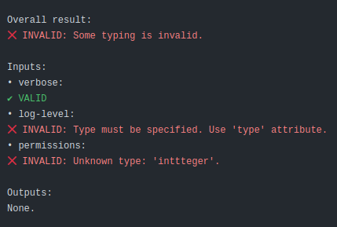

# Work in progress! Not ready to use.

---

# GitHub Actions typing

Bring type-safety to your GitHub actions' API!

This is a GitHub action that validates your action's manifest (action.y(a)ml) and ensures the inputs and outputs have
types set according to a certain specification.

# Example

Let's say your action has such manifest:

```yaml
name: My cool action
description: Just to showcase GitHub Actions typing
typingSpec: krzema12/github-actions-typing@v0.1
inputs:
  verbose:
    description: 'Set to true to display debug information helpful when troubleshooting issues with this action.'
    required: false
    default: 'false'
    type: boolean
  log-level:
    description: 'Specify the level of details for logging.'
    required: true
  permissions:
    description: 'Who should have access.'
    type: inttteger
runs:
  using: 'node16'
  image: 'dist/main.js'
```

This action, once used within a workflow, will fail the workflow run and produce such output:



# Usage

In your action's `action.yml`:

- add top-level attribute: `typingSpec: krzema12/github-actions-typing@v0.1`. Thanks to this, you as the actions' author
  state which kind of typings your actions adheres to. At the time of writing this, no standard has emerged yet. This
  attribute is there to be able to tell the specs apart in the future, for example if GitHub publishes a first-party way
  to specify types.
- specify types for your action's inputs and outputs. See _"Available types"_ section below.

Finally, create a workflow in your actions' repository that will simply call this action to validate the types:

```yaml
name: Validate action typings

on:
  push: [main]
  pull_request:
  workflow_dispatch:

jobs:
  validate-typings:
    runs-on: "ubuntu-latest"
    steps:
      - uses: actions/checkout@v3
      - uses: krzema12/github-actions-typing@v0
```

## Available types

### String

A text value.

Example:

```yaml
...
inputs:
  name:
    type: string
    ...
```

### Boolean

Can be `true` or `false`.

Example:

```yaml
...
inputs:
  verbose:
    type: boolean
    ...
```

### Integer

A number without a fractional component.

Example:

```yaml
...
inputs:
  retries:
    type: integer
    ...
```

### Float

A number with a fractional component.

Example:

```yaml
...
inputs:
  threshold:
    type: float
    ...
```

### Enum

Multiple possible values.

Example:
```yaml
...
inputs:
  permissions:
    type: enum
    allowedValues:
      - user
      - admin
      - guest
    ...
```